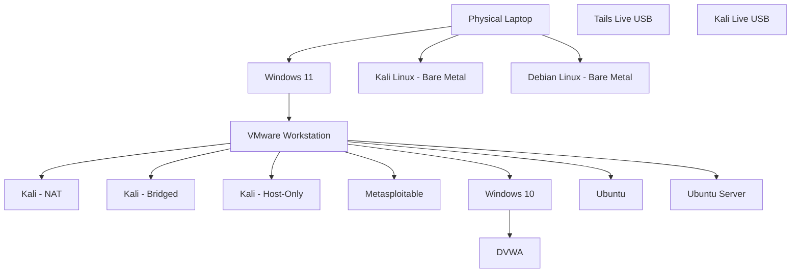

# Personal Cybersecurity Lab

A personally operated cybersecurity laboratory used for hands-on learning in web security, network security, vulnerability assessment, and penetration testing. This repository documents the lab's architecture, configuration, methodology, and findings as work is actually performed.

**Status:** Active / Evolving

---

## Description

This repository documents a real, self-hosted cybersecurity lab running across a triple-boot physical laptop, a VMware Workstation virtualization layer, and two portable live-boot USB environments. It exists to support structured, authorized, hands-on practice — not to present a finished product.

Content is added only as work is actually done. Sections not yet completed are explicitly marked `[TO BE DOCUMENTED]` rather than filled with placeholder claims.

---

## Architecture



Windows 11, Kali Linux, and Debian Linux are separate **bare-metal** operating systems in a triple-boot configuration — not virtual machines. VMware Workstation runs only under Windows 11. Tails and Kali Live are independent bootable USB environments, unrelated to the VMware lab.

See [`architecture/`](architecture/README.md) for full details.

---

## Environment Overview

| Environment | Type | Host | Purpose |
|---|---|---|---|
| Windows 11 | Bare metal | Physical laptop | VMware virtualization host |
| Kali Linux | Bare metal | Physical laptop | Native security testing OS |
| Debian Linux | Bare metal | Physical laptop | General Linux environment |
| Tails Live USB | Portable live boot | USB | Privacy-oriented live environment |
| Kali Live USB | Portable live boot | USB | Portable security testing |
| Kali-NAT | VMware VM | Windows 11 | Internet-connected testing |
| Kali-Bridged | VMware VM | Windows 11 | LAN-facing testing |
| Kali-Host-Only | VMware VM | Windows 11 | Isolated attacker environment |
| Metasploitable | VMware VM | Windows 11 | Intentionally vulnerable target |
| Windows 10 (+ DVWA) | VMware VM | Windows 11 | Web application security target |
| Ubuntu | VMware VM | Windows 11 | Linux security testing |
| Ubuntu Server | VMware VM | Windows 11 | Server-side Linux testing |

---

## Security Objectives

- Practice reconnaissance, enumeration, and vulnerability assessment methodology
- Practice web application security testing against DVWA
- Build Burp Suite proficiency
- Practice Linux and Windows security fundamentals
- Build a documented, repeatable security testing workflow
- Prepare for bug bounty and professional security work
- Build a technical portfolio demonstrating hands-on lab work

---

## Lab Components

- **Physical layer:** [`physical-environment/`](physical-environment/README.md)
- **Live USB environments:** [`live-environments/`](live-environments/README.md)
- **Virtualization layer:** [`virtualization/`](virtualization/README.md)
- **Web security practice:** [`web-security/`](web-security/README.md)
- **Network security practice:** [`network-security/`](network-security/README.md)
- **Vulnerability assessment:** [`vulnerability-assessment/`](vulnerability-assessment/README.md)
- **Penetration testing:** [`penetration-testing/`](penetration-testing/README.md)
- **Security automation:** [`security-automation/`](security-automation/README.md)

---

## Networking

The VMware lab uses three network modes for the Kali VMs:

| Mode | Purpose |
|---|---|
| NAT | Internet-connected testing environment |
| Bridged | VM appears as a device on the physical LAN |
| Host-Only | Isolated host-to-VM lab network |

See [`architecture/network-architecture.md`](architecture/network-architecture.md) for details and placeholders for subnet/DHCP information.

---

## Security Testing Workflow

```text
Scope → Reconnaissance → Enumeration → Service Analysis →
Vulnerability Identification → Validation → Evidence Collection →
Risk Assessment → Remediation → Retesting → Reporting
```

Full explanation: [`penetration-testing/README.md`](penetration-testing/README.md)

---

## Repository Structure

```text
personal-cybersecurity-lab/
├── architecture/              Architecture documentation and diagrams
├── physical-environment/      Bare-metal triple-boot documentation
├── live-environments/         Tails and Kali Live USB documentation
├── virtualization/            VMware lab and VM documentation
├── web-security/              DVWA, Burp Suite, HTTP testing
├── network-security/          Recon, enumeration, scanning, packet analysis
├── vulnerability-assessment/  Nmap, scanning, findings
├── penetration-testing/       Full methodology stages
├── security-automation/       Scripts and workflows
├── reports/                   Completed reports by category
├── screenshots/               Evidence screenshots by category
├── scripts/                   Reusable testing scripts
├── notes/                     Concise technical notes
└── templates/                 Reusable documentation templates
```

---

## Safety / Authorization Statement

All testing documented in this repository is performed exclusively against systems I personally own and control within my own isolated lab environment (VMware VMs, Metasploitable, DVWA, and bare-metal systems under my control). No testing is performed against third-party systems, networks, or infrastructure without explicit written authorization. This repository does not contain and will never contain live credentials, private keys, or other sensitive data — see [`SECURITY.md`](SECURITY.md).

---

## Current Status

| Area | Status |
|---|---|
| Lab infrastructure | Active |
| Architecture documentation | Active |
| Web security testing (DVWA) | Not Yet Tested |
| Network security testing | Not Yet Tested |
| Vulnerability assessment | Not Yet Tested |
| Penetration testing | Not Yet Tested |
| Security automation | Planned |

---

## Future Expansion

Planned, not yet implemented:

- API security testing
- Cloud security labs
- Active Directory security
- Container / Docker security
- CI/CD security
- Malware analysis
- SOC / blue-team exercises
- Detection engineering

---

## License

Released under the [MIT License](LICENSE).
