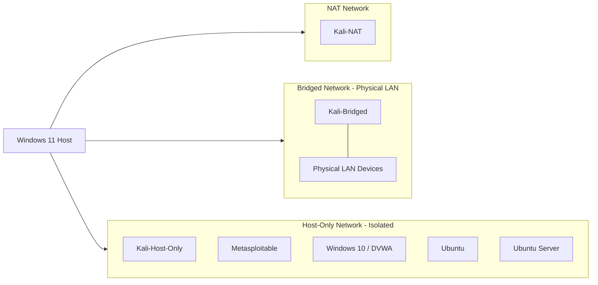

# Network Topology Diagram

**Note:** Which target VMs sit on which virtual network (NAT/Bridged/Host-Only) is not fully confirmed for every machine. Verify actual per-VM network adapter settings before relying on this diagram; update it once confirmed. See [`network-architecture.md`](../network-architecture.md) for placeholders.
