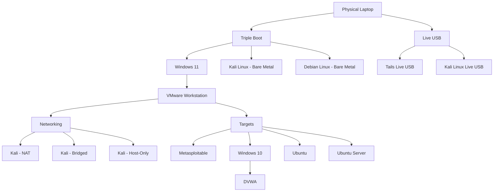

# Overall Architecture Diagram

```mermaid
flowchart TB
    A[Physical Laptop]

    A --> TB[Triple Boot]
    A --> LU[Live USB]

    TB --> W11[Windows 11]
    TB --> KaliBM[Kali Linux - Bare Metal]
    TB --> Deb[Debian Linux - Bare Metal]

    LU --> Tails[Tails Live USB]
    LU --> KaliLive[Kali Linux Live USB]

    W11 --> VMW[VMware Workstation]

    VMW --> Net[Networking]
    VMW --> Tar[Targets]

    Net --> NAT[Kali - NAT]
    Net --> Bridged[Kali - Bridged]
    Net --> HostOnly[Kali - Host-Only]

    Tar --> Meta[Metasploitable]
    Tar --> Win10[Windows 10]
    Win10 --> DVWA[DVWA]
    Tar --> Ubu[Ubuntu]
    Tar --> UbuS[Ubuntu Server]
```

This diagram mirrors the summary diagram in the [root README](../../README.md) with the Triple Boot / Live USB / Networking / Targets groupings made explicit.
